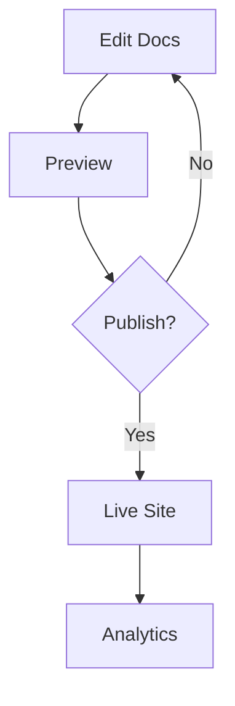

## Account and Billing

Peasy handles your subscription through a simple dashboard. You manage billing details directly in your account settings.

<Columns cols={2}>
  <Card title="Upgrade Plan" icon="arrow-up" href="/account/plans">
    Switch to Pro or Enterprise for advanced features like custom domains.
  </Card>
  <Card title="View Invoices" icon="file-text" href="/account/invoices">
    Download PDF invoices and review payment history.
  </Card>
</Columns>

<ExpandableGroup>
  <Expandable title="How do I change my billing information?" default-open="true">
    Navigate to Account > Billing. Update your card details or payment method. Changes take effect immediately on the next cycle.
  </Expandable>
  <Expandable title="What payment methods do you accept?">
    Peasy supports credit cards (Visa, Mastercard, Amex) and PayPal. Enterprise plans offer wire transfer options.
  </Expandable>
  <Expandable title="Can I cancel my subscription anytime?">
    Yes, cancel from the Billing page. You retain access until the end of your current billing period. No refunds for partial months.
  </Expandable>
</ExpandableGroup>

<Callout kind="tip">
  Track usage limits in your dashboard to avoid surprises during billing cycles.
</Callout>

## Troubleshooting Common Issues

Most issues resolve quickly with these steps. Start with basic checks before contacting support.

<Steps>
  <Step title="Check Status" icon="check-circle">
    Visit the Peasy status page at `status.peasy.dev` to confirm service availability.
  </Step>
  <Step title="Clear Cache" icon="refresh-cw">
    In your browser, clear cache and cookies. Then reload the documentation site.
  </Step>
  <Step title="Verify Permissions" icon="shield">
    Ensure your account role allows edits. Admins see a lock icon on restricted pages.
  </Step>
  <Step title="Contact Support" icon="mail">
    Submit a ticket with screenshots and browser details.
  </Step>
</Steps>

<CodeGroup tabs="Browser,CLI">
```bash
# Clear local cache via CLI
peasy cache clear --project=my-docs
```
```javascript
// Check project status in Node.js
const peasy = require('peasy-sdk');
peasy.status('my-docs').then(status => console.log(status));
```
</CodeGroup>

## Best Practices for Documentation

Follow these guidelines to create maintainable docs that scale with your project.

<Tabs>
  <Tab title="Structure" icon="layout">
    Organize into clear hierarchies: Use H2 for main sections, H3 for subsections. Link related pages with `<Card>` components for navigation.
  </Tab>
  <Tab title="Code Examples" icon="code">
    Always use language-specific fenced blocks. For multi-language support, wrap in `<CodeGroup>`.

````jsx
<CodeGroup tabs="JavaScript,Python">
  ```javascript fetch('/api/users') ```
  ```python requests.get('/api/users') ```
</CodeGroup>
````
  </Tab>
  <Tab title="Versioning" icon="git-branch">
    Pin docs to releases using branches like `v1.0`. Promote stable versions to main.
  </Tab>
</Tabs>

<Callout kind="info">
  Preview changes before publishing to catch rendering issues early.
</Callout>

## Advanced Features Overview

Unlock more with Pro features.

| Feature | Description | Use Case |
|---------|-------------|----------|
| Custom Domains | Map your docs to `docs.yoursite.com` | Branded experiences |
| Analytics | Track page views and search queries | Content optimization |
| Webhooks | Integrate with CI/CD pipelines | Automated deployments |
| SSO | Single sign-on with Google or Okta | Team access control |



<Expandable title="How to set up webhooks?">
  Go to Settings > Integrations. Add your endpoint URL and select events like `page.updated`.
</Expandable>