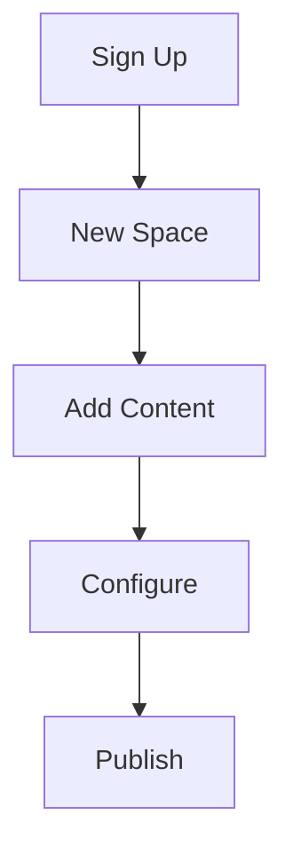

## Overview

Get started with Peasy in minutes. Follow these steps to create an account, set up your first project, explore the interface, and apply essential configuration tips. Peasy simplifies documentation management for teams, enabling collaborative spaces for API docs, guides, and changelogs.

<Callout kind="tip">
  New to Peasy? Complete the quickstart to unlock full features like custom themes and version control.
</Callout>

## Create Your Account

Sign up for a free Peasy account to access unlimited documentation spaces.

<Steps>
  <Step title="Visit Peasy" icon="globe">
    Go to `https://peasy.dev` and click **Sign Up**.
  </Step>
  <Step title="Enter Details" icon="user">
    Provide your email, create a strong password, and verify your account via email.
  </Step>
  <Step title="Complete Onboarding" icon="check-circle">
    Select your team size and preferred documentation type (API, Product, or Internal).
  </Step>
</Steps>

## Set Up Your First Project

Create a new documentation space and import your first content.

<Steps>
  <Step title="New Space" icon="plus">
    From the dashboard, click **New Space** and name it `MyProjectDocs`.
  </Step>
  <Step title="Configure Basics" icon="settings">
    Set the space slug to `myproject` and enable version history.
  </Step>
  <Step title="Add Content" icon="file-text">
    Upload Markdown files or use the editor to create your first page.

    ```bash
    # Install Peasy CLI for local editing
    npm install -g @peasy/cli
    peasy init myproject
    ```
  </Step>
</Steps>

<CodeGroup tabs="JavaScript,Python">
```javascript
// peasy.config.js - Local configuration
module.exports = {
  space: 'myproject',
  apiKey: process.env.PEASY_API_KEY,
  theme: 'default'
};
```
```python
# peasy_config.py - Python config example
config = {
    "space": "myproject",
    "api_key": os.getenv("PEASY_API_KEY"),
    "theme": "default"
}
```
</CodeGroup>

## Navigate the Interface

Peasy's dashboard provides quick access to your spaces. Use these key sections:

<Tabs>
  <Tab title="Dashboard" icon="layout">
    View recent spaces, analytics, and quick actions.

    | Section     | Purpose                  |
    |-------------|--------------------------|
    | Spaces      | List all documentation spaces |
    | Analytics   | Usage and visitor stats  |
    | Templates   | Pre-built doc starters   |
  </Tab>
  <Tab title="Editor" icon="edit-3">
    Real-time Markdown and MDX editor with live preview.
  </Tab>
  <Tab title="Publish" icon="globe">
    Deploy changes with one click. Custom domains supported.
  </Tab>
</Tabs>

## Initial Configuration Tips

Optimize your space from the start.

<ExpandableGroup>
  <Expandable title="Set Environment Variables" default-open="true">
    Store your API key securely.

    ```bash
    export PEASY_API_KEY=pk_1234567890abcdef
    peasy deploy
    ```
  </Expandable>
  <Expandable title="Custom Theme">
    Apply brand colors in space settings:

    ```json
    {
      "primaryColor": "#3B82F6"
    }
    ```
  </Expandable>
</ExpandableGroup>

<Callout kind="success">
  Success! Your first space is ready. Monitor analytics to track engagement.
</Callout>

## Next Steps

Explore advanced features:

<Columns cols={3}>
  <Card title="API Reference" icon="code" href="/docs/api">
    Integrate Peasy with your codebase.
  </Card>
  <Card title="Collaboration" icon="users" href="/docs/teams">
    Invite team members and set permissions.
  </Card>
  <Card title="Custom Domains" icon="globe" href="/docs/domains">
    Publish under your domain.
  </Card>
</Columns>

